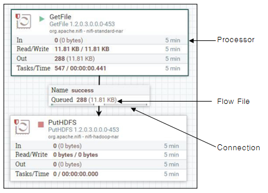

# 기본 개념 및 컨셉

## 기본 개념 및 컨셉
NiFi는 데이터흐름을 쉽게 관리하도록 설계된 프로세싱 엔진이다. 모든 흐름은 logic, transform, enrichment 등 여러단계를 거치는 데이터 조각으로 이루어집니다. 
데이터조각은 아래와 같은 개념으로 구성되어 있습니다.

| NiFi 용어 | 설명 | 비고 |
|:--------:|:--------|:--------|
| FlowFile | Nifi에서 데이터를 표현하는 객체로, Key/Value 형태의 데이터 속성(Attribute)과  데이터(Content)를 포함할 수 있다. 데이터는 0바이트 이상의 데이터가 저장될 수 있다.  FlowFile를 이용하여 여러 시스템 간의 데이터 이동이 가능하다. | 기본 |
| Processor | FlowFile은 여러 단계에 걸쳐 속성이 추가되거나 내용이 변경될 수 있는데, 이때 사용되는 것이 Processor이다. NiFi는 150개 이상의 Processro를 제공하며, 이를 이용하여 FlowFile을 다양한 시스템으로부터 읽어와 변경, 저장, 라우팅, 중재 등을  할 수 있다. | 기본  ex> ExecuteSQL, RouteOnAttribute 등 |
| Connection | Processor간의 연결을 의미하며, NiFi의 Connection은 queue역할을 하며  라우팅, 우선순위, 역압등 기능을 통해 다양한 프로세스가  상호 작용할 수 있도록 도와준다. | 기본 |
| Flow Controller | Processor가 어느 간격 또는 시점에 실행하는지 스케줄링한다. | ex> Cron |
| Process Group | 특정업무, 기능단위로 여러 Processor를 묶을 수 있으며, Input과 Output포트를 제공해 Process Group간의 데이터 이동이 가능하다. |  |
| Remote Process Group | 다른 NiFi시스템과 Site-to-Site 프로토콜을 이용해 데이터를 주고 받을 수 있다. Remote Input Port와 Output Port 사용 |  |
| Controller Service | Processor간 자원을 공유할 수 있도록 도와준다. | ex> DBCPConnectionPool, Cache 등 |

정리하면, FlowFile은 NiFi가 인식하는 데이터 단위이고 Processor는 FlowFile을 수집, 변형, 저장하는 기능을 한다. 그리고 Connection은 Processor와 Processor을 연결하여 FlowFile을 전달한다. 
데이터 흐름은 이런 컴포넌트들을 조합하여 구성한다.
 </img> 

## 아키텍쳐
