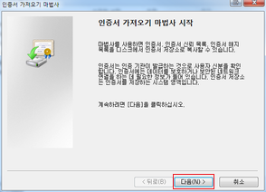

# 기본 설정 및 로그인 방
이 글은 Apache NiFi의 기본 설정 변경에 대해 설명한다. 
Apache NiFi의 기본 개념 및 컨셉을 이해하고 있다는 가정에서 진행한다.

## 1.실행 포트번호 변경
NiFi에서는 http 기본 포트를 8080으로 사용한다.<br/>
다른 포트로 바꿀려면 conf/nifi.properties파일을 아래와 같이 수정하면 된다.
```properties
# http로 구동시 사용할 포트 정보.
# 하단의 nifi.web.https.port가 있을시 비워둬야함.
nifi.web.http.port=8000
```
[NiFi 재구동](http://59.25.178.122:9000/sokangmin/winitech-nifi/blob/master/README.md#nifi-standalone-install) 후 http://localhost:8000/nifi 으로 접속하여 확인 

## 2.https로 변경
### https 설정
NiFi에서는 http로 기본 동작한다.<br/>
htts로 바꿀려면 conf/nifi.properties파일을 아래와 같이 수정하면 된다.
```properties
# agent와 collector간의 데이터 연계시, 암호화(https)를 사용할지 여부.
# 기본은 false이고 false이면 nifi가 http로 구동되고 https 설정은 무시됨.
# 암호화 사용 및 https로 구동하기를 원하면 true로 세팅.
nifi.remote.input.secure=true
...
# http로 구동시 사용할 포트 정보.
# 하단의 nifi.web.https.port가 있을시 비워둬야함.
nifi.web.http.port=
...
# https로 구동시 사용할 포트 정보.
# 상단의 nifi.web.http.port가 있을시 비워둬야함.
nifi.web.https.port=8443
```
[NiFi 재구동](http://59.25.178.122:9000/sokangmin/winitech-nifi/blob/master/README.md#nifi-standalone-install) 후 https://localhost:8443/nifi 으로 접속하여 확인
### https 로그인
NiFi에서는 인증서방식을 통해 https에 접속하는 사용자를 인증한다.<br/>
그래서 https로 접속하기 위해서는 인증서가 필요하다.
- 인증서 설치
    - certs/standalone.p12 파일을 더블클릭한다. 아래와 같은 화면이 나타나면 계속 다음을 클릭한다.
    - 암호는 인증서 생성시 입력한 값(ex>password123)을 입력한다.<br/>
</img></img>

### https 접속
https://localhost:8443/nifi 으로 접속하면 아래와 같은 화면이 나타난다.<br/>
</img><br/>
인증서를 선택하면 NiFi 화면으로 이동한다.<br/>
</img>
