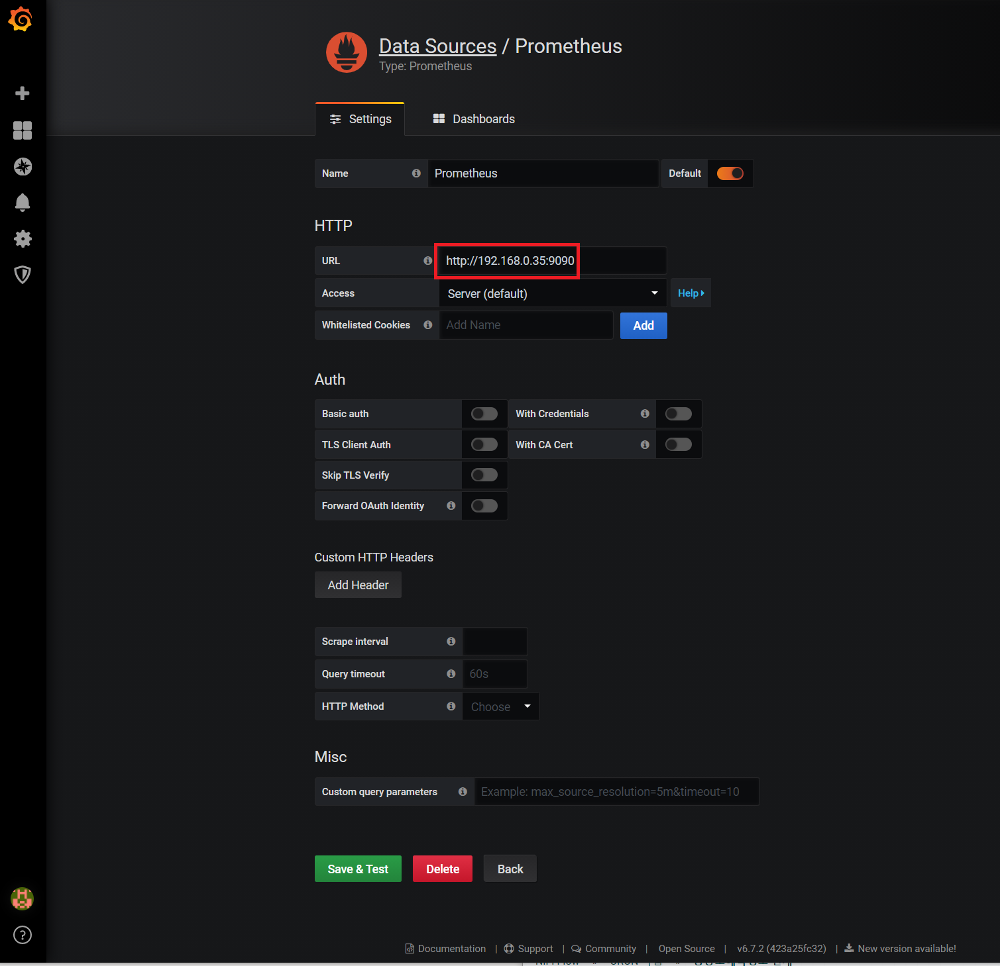
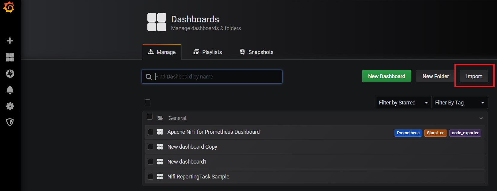

# Grafana 설치방법
이 글은 Apache NiFi의 모니터링 대시보드에 사용할 Grafana설치방법에 대해 설명한다. <br/>
- OS : CentOS 7

### 1. Grafana 다운로드
```bash
$ wget https://dl.grafana.com/oss/release/grafana-7.4.2.linux-amd64.tar.gz
```
### 2. 압축해제
```bash
$ tar -zxvf grafana-7.4.2.linux-amd64.tar.gz
```

### 3. 실행
```bash
$ cd grafana-7.4.2/bin
$ ./grafana-server
# 기본 포트 3000 사용
```

### 5. 테스트
- url : http://{설치서버ip}:3000 </br>
웹페이지에 접속에 성공하면 아래와 같은 초기화면이 표시.
</img><br/>

### 6. Prometheus와의 연동
- Configuration > Data Sources 메뉴에서 Prometheus 정보 등록.
</img><br/>
- Dashboards > manage 매뉴에서 import를 클릭하여 Dashboard등록.
  - [Apache NiFi for Prometheus Dashboard.json](https://github.com/sokangmin/wini-nifi/blob/master/image/Apache%20NiFi%20for%20Prometheus%20Dashboard.json) 다운로드.
    - Apache NiFi for Prometheus Dashboard는 [node_exporter Dashboard](https://github.com/starsliao/Prometheus/tree/master/node_exporter) 를 참고하여 만듬.
  - Upload.json file을 클릭하여 등록<br/>
</img><br/>
- 등록한 Dashboard를 클릭하면 아래와 같은 Dashboard가 표시됨
</img><br/>

### 7. Dashboard 설명
- Dashboard는 메뉴, NiFi 모듈 정보, NiFi 서버 정보로 3가지 파트로 나뉨.
- 메뉴에는 Project와 module이라는 선택항목이 있음.
  - Project는 ROOT 프로세스그룹 안에 만들어진 하위프로세스그룹에 대한 정보임.
  - module은 Project안의 하위프로세스에 다한 정보임.
  - 아래와 같이 Project와 module을 선택하면 NiFi 모듈 정보에 표시된다.
  - </img><br/>
  
