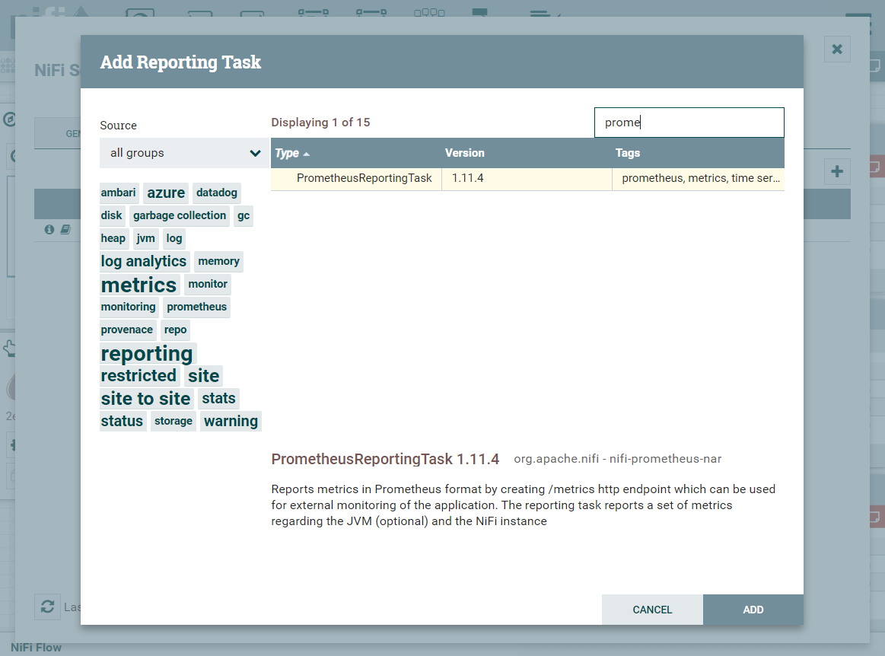

# Prometheus 설치방법
이 글은 Apache NiFi의 모니터링 대시보드에 사용할 Prometheus설치방법에 대해 설명한다. <br/>
- OS : CentOS 7

### 1. Prometheus 다운로드
```bash
$ wget https://github.com/prometheus/prometheus/releases/download/v2.20.1/prometheus-2.20.1.linux-amd64.tar.gz
```
### 2. 압축해제
```bash
$ tar zxvf prometheus-2.20.1.linux-amd64.tar.gz
```
### 3. prometheus.yml 파일 수정
```bash
$ cd prometheus-2.20.1.linux-amd64
$ vi prometheus.yml
# my global config
global:
  scrape_interval:     10s # Set the scrape interval to every 10 seconds. Default is every 1 minute.
  evaluation_interval: 10s # Evaluate rules every 10 seconds. The default is every 1 minute.
  # scrape_timeout is set to the global default (10s).

# A scrape configuration containing exactly one endpoint to scrape:
# Here it's Prometheus itself.
scrape_configs:
  # The job name is added as a label `job=<job_name>` to any timeseries scraped from this config.
  - job_name: 'prometheus'

    # metrics_path defaults to '/metrics'
    # scheme defaults to 'http'.                                                                                        
    static_configs:
    - targets: ['localhost:9090']
    
    # apache nifi
    - job_name: 'apache nifi'
    static_configs:
    - targets: ['localhost:9092']

    # node_exporter
    - job_name: 'node'
    static_configs:
    - targets: ['localhost:9100']

```

### 4. 실행
```bash
$ ./prometheus
```

### 5. 테스트
- 메트릭 url : http://localhost:9090/metrics
- PromQL테스트 url : http://localhost:9090

### 6. NiFi 와의 연동
- NiFi의 Controller Settings > REPORTING TASKS 탭 선택
- Create a new reporting task를 클릭하고 PrometheusReportinTask 선택
</img><br/>


### ※ 참고 블로그
- 참고: https://velog.io/@ckstn0777/prometheus%ED%94%84%EB%A1%9C%EB%A9%94%ED%85%8C%EC%9A%B0%EC%8A%A4%EB%9E%80
