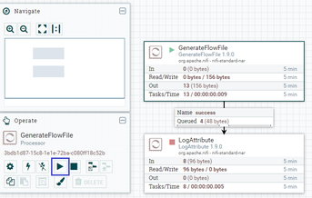
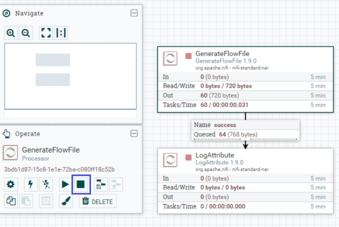

# Getting Started with Apache NiFi
## Terminology Used in This Guide
NiFi를 사용하는데 필요한 핵심용어를 개략적으로 설명한다.
- FlowFile : 사용자가 처리를 위해 NiFi로 가져오는 데이터를 FlowFile이라고 한다. FlowFile은 Attribute(속성), Content(본문)으로 구성된다. Content는 사용자 데이터 자체이다. Attribute는 사용자 데이터와 연관된 key-value 속성값이다.
- Processor : Processor는 FlowFile의 생성, 전송, 수신, 변환, 라우팅 ,분할, 병합 및 처리를 담당하는 NiFi 구성요소이다.
## NiFi 설치 및 구동
- [NiFi 기본설치방법](./docs/tutorial_install.md)
- [NiFi Cluster 설치방법](./docs/tutorial_cluster_install.md)
- [NiFi Registry 설치 및 적용방법](./docs/tutorial_registry.md)
- [NiFi 와 LDAP 연동방법](./docs/tutorial_nifi_ldap.md)
- [NiFi Site-to-Site 구성방법](./docs/tutorial_S2S_install.md)

## Started NiFi. Now What?
NiFi가 시작되었으므로 데이터 흐름을 만들고 모니터링하기 위해 사용자 인터페이스를 불러올 수 있다. 시작하려면 웹 브라우저를 열고 http://localhost:8080/nifi 로 이동한다. 포트는 설정파일로 변경 기본포트는 8080이다. ([NiFi 포트 변경 및 https접속방법](./docs/tutorial_conf.md)) 
그러면 데이터 흐름을 조정하기 위한 빈 캔버스인 사용자 인터페이스가 나타난다: 
<image src='./image/new-flow.png' width='50%' height='50%'/> 
UI에는 데이터흐름을 만들고 관리하는 여러 도구가 있다: 
<image src='./image/nifi-toolbar-components.png' width='50%' height='50%'/> 

- Components Toolbar : NiFi에서 사용하는 컴포넌트들이 있다. 이 컴포넌트를 클릭하여 드래그&드롭으로 캔버스에 컴포넌트를 등록시킬 수 있다.
- Status Bar : NiFi의 현재 상황을 볼 수 있다. 실행되고 있는 태스크, Processor수 정보와 오류정보, 클러스터 노드 정보 등을 제공한다.
- Search : NiFi에 등록된 Processor, Connection을 검색할 수 있다.
- Operate Palette : NiFi컴포넌트들의 설정, 활성화/비활성화, 시작/정지, 템플릿 생성/등록, 컴포넌트 복사/붙여넣기, Processor Group 화, 컴포넌트 색 변경, 컴포넌트 삭제 등을 제공한다. 캔버스에서 컴포넌트를 선택하면, 상황에 따라 버튼들이 활성화된다. 또, 캔버스에서 Shift + 선택 또는 Shift + 선택영역 드래그를 통해 여러 개의 컴포넌트 선택 할 수 있다. (참고로, Ctrl + r은 새로고침이다.)

글로벌 메뉴에는 다음과 같은 옵션이 있다: 
<image src='./image/global-menu.png' width='20%' height='20%' /> 

- Summary : NiFi에 등록된 컴포넌트들을 종합적으로 보고, 검색할 수 있다.
- Counter : 특정 Processor에서 발생시키는 카운트 정보를 제공한다.
- Bulletin Board : 시스템의 문제 등을 볼 수 있다.
- Data Provenance : 데이터를 추적할 수 있다.
- Controller Settings : FlowFile Controller의 설정(쓰레드 개수)과 DB Poll, Cache 서비스와 같은 컨트롤러 서비스를 관리한다.
- Flow Configuration History : FlowFile의 등록, 삭제, 변경 등의 이력을 제공한다.
- Users, Polices : 사용자 및 권한을 관리 한다. 인증시스템(Https, Kerberos, Ldap 등)이 활성화된 경우에만 메뉴가 보인다.
- Templates : Processor와 그 들의 연결정보인 Connection 컴포넌트를 속성까지도 유지 한 체 템플릿화 할 수 있는데, 이렇게 등록된 템플릿을 조회하고, 내려받을 수 있는 기능을 제공한다.
- Help : 도움말을 제공한다.
- About : NiFi버전 정보를 제공한다

NiFi는 Process 등록 및 연결을 통해 모든 연계흐름을 작성한다. 간단한 연계 흐름 작성을 예제로 Process 등록 및 연결을 설명한다.
### Adding a Processor
캔버스에 Processor를 추가하여 연계흐름 생성을 시작한다. 데이터의 시작과 종료를 모두 Processor로 수행하므로 가장 많이 사용하는 기본 기능이다.
- 화면왼쪽상단의 Processor 아이콘(<image src='./image/iconProcessor.png' width='2%' height='2%'/>)을 캔버스로 드래그하면 추가 할 Processor를 선택할 수 있는 대화 상자가 표시된다:  
<image src='./image/add-processor.png' width='43%' height='43%'/> 
- 사용할 Processor를 목록에서 선택하고, ADD버튼을 눌러 등록한다.(여기서는 예제로  GenerateFlowFile Processor을 선택)
<image src='./image/image14.png'/> 
- 동일한 방식으로 Log를 출력할 때 쓰는 Log Attribute Processor를 등록한다. 
<image src='./image/image15.png'/>  
- 아래와 같이 Processor를 구성한다. 
<image src='./image/image17.png'/>  

### Connecting Processor
NiFi는 RelationShip을 통해 각 Processor에서 처리한 FlowFile을 어느 Processor로 보낼지 라우팅을 할 수 있다. Processor가 FlowFile 처리를 마치면 연결된 RelationShip으로 FlowFile을 전송한다. 예제에서는 GenerateFlowFile -> LogAttribute로 FlowFile을 전송한다.

- GenerateFlowFile에 마우스를 오버하면 RelationShip을 설정하는 화살표가 나타난다. 이 화살표를 드래그하여 아래의 LogAttribute에 연결한다. 
<image src='./image/image18.png'/> 
- 이 연결에 포함할 RelationShip을 선택할 수 있는 대화상자가 나타난다. 예제에서는 success를 선택한다. 
<image src='./image/connection-details.png' width='43%' height='43%'/> 
- 설정 탭을 클릭하면 이 연결의 작동 방식을 구성하기 위한 옵션을 보여준다. 
<image src='./image/connection-settings.png' width='43%' height='43%'/> 
  - name : Connection의 이름을 지정 할 수 있다. 그렇지 않으면 이름은 선택한 RelationShip을 기반으로 한다.
  - FlowFile Expiration : 데이터의 만료시간을 설정할 수 있다. 기본적으로 O sec로 설정된다.(무한대) 특정 만료시간에 도달하게 되면 대기중인 FlowFile이 삭제된다.
  - Back Pressure Object Threshold, Size Threshold : Back Pressure 임계치를 FlowFile 개수 또는 사이즈로 조절할 수 있다. 데이터를 가져오는 Processor는 임계치에 도달하게되면 시스템이 복구 할수 있도록 새 데이터 가져오기를 중지한다.
  - Prioritizers : FlowFile을 처리하기 위한 우선순위 정책을 설정한다. 여러개의 우선순위 정책이 활성화 된 경우 먼저 나열된 우선 순위가 먼저 평가된다.
- 아래와 같이 Relationship을 구성한다. 
<image src='./image/image19.png'/> 
GenerateFlowFile Processor의 경고아이콘(<image src='./image/iconAlert.png' width='2%' height='2%'/>)이 중지아이콘(<image src='./image/iconStop.png' width='2%' height='2%'/>)으로 변경된 것을 볼 수 있다. 그러나 LogAttribute Processor는 success 관계가 아무것도 연결되지 않아 경고아이콘(<image src='./image/iconAlert.png' width='2%' height='2%'/>)으로 남아 있는걸 볼 수 있다. 이는 LogAttribute Processor의 success 관계를 "Auto Terminated"로 보내 연계 흐름이 완료된 것으로 간주되게 변경해야 한다.

### Configure Processor
Configure를 통해 각 Processor의 세부설정을 수정한다. 예시에서는 GenerateFlowFile, LogAttribute의 몇몇 설정정보를 변경하고 저장한다.

- GenerateFlowFile Processor에서 오른쪽 마우스버튼을 클릭하고 Configure를 선택한다. 
<image src='./image/image20.png'/> 
- SCHEDULING 탭의 Run Schedule를 0 sec에서 5 sec로 수정한다. 
<image src='./image/image21.png'/> 
- PROPERTIES 탭의 Custom Text에 Hello World!를 입력하고 OK버튼을 클릭한다. 
<image src='./image/image22.png'/> 
- 동일한 방식으로 LogAttribute의 세부 설정을 수정한다.
  - SETTING탭의 Automatically Terminate Relationships의 success항목을 체크한다.
  - PROPERTIES 탭의 Log PayLoad를 true로 수정한다.
 
※ 아래와 같이 Processor에 느낌표가 표시되면 세부설정이 유효하지  아직 구동할 준비가 되지 않았다는 표시입니다. 위의 설정을 다시 체크해보시기 바랍니다. 
<image src='./image/image16.png'/> 

### Starting and Stopping Processors
- 구동할 Processor를 선택하고 [Operate Palette](#operate-palette)의  시작 버튼을 클릭한다. 

- 정지할 Processor를 선택하고 [Operate Palette](#operate-palette)의 정지 버튼을 클릭한다. 

## 출처
- https://nifi.apache.org/docs/nifi-docs/html/overview.html
